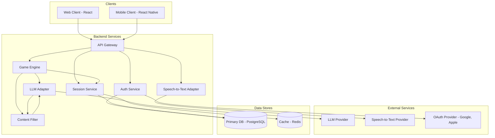
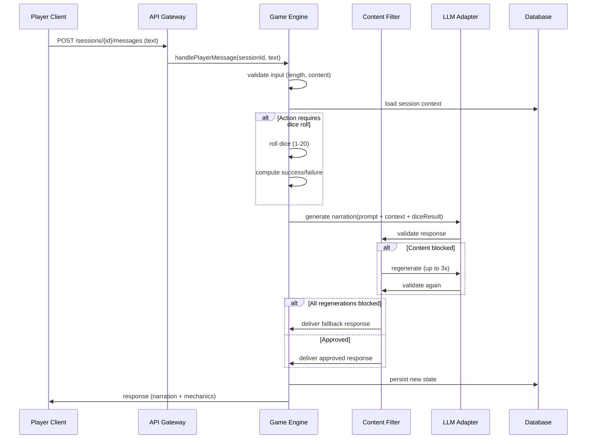
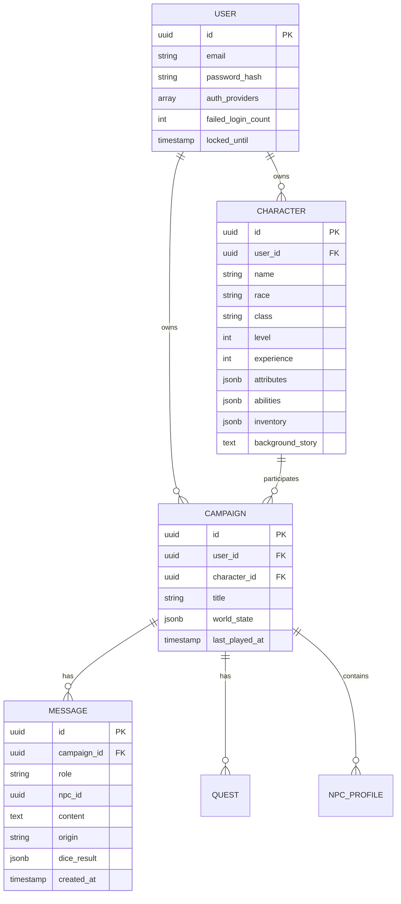

# Design Document

## Overview

Dieses Design beschreibt ein KI-gestütztes, D&D-artiges Rollenspiel für mobile Plattformen (Android, iOS) und Webbrowser. Ein Large Language Model (LLM) übernimmt die Rolle des Game Masters und der NPCs und reagiert dynamisch auf natürliche Spracheingaben des Spielers (Text und optional Sprache). Das System generiert Kampagnen, verwaltet Spielcharaktere, würfelt für unsichere Aktionen, filtert Inhalte für die Altersgruppe ab 12 Jahren und persistiert den Spielstand plattformübergreifend.

### Wesentliche Designentscheidungen

- **Cross-Platform mit geteiltem Backend:** Ein zentrales Backend stellt eine REST/WebSocket-API bereit, die von einem nativen Mobile-Client (über React Native für Code-Sharing zwischen Android und iOS) und einem Web-Client (React) konsumiert wird. Begründung: Plattformübergreifende Synchronisation (R6.4) und konsistente Spielzustände erfordern eine Single Source of Truth serverseitig; LLM-Aufrufe erfordern API-Schlüssel, die nicht im Client liegen dürfen.
- **LLM als externer Service mit Adapter-Schicht:** Das Spiel verwendet einen austauschbaren LLM-Provider (z. B. OpenAI, Anthropic, Mistral) hinter einer abstrakten Schnittstelle. Begründung: Vermeidung von Vendor-Lock-in, einfacher A/B-Test verschiedener Modelle, lokale Mocks für Tests.
- **Trennung von Spielmechanik und Narration:** Würfelwürfe, Erfahrungspunkte, Levelaufstieg und Charakterstand werden deterministisch in einer Engine-Schicht berechnet. Das LLM wird ausschließlich für Narration und Dialog verwendet und erhält die mechanischen Ergebnisse als strukturierten Kontext. Begründung: Faire, nachvollziehbare Mechanik (R9), die nicht der Halluzination eines LLM unterliegt.
- **Content-Filter als eigenständige Pipeline-Stufe:** Jede LLM-Ausgabe durchläuft den Content-Filter vor der Auslieferung. Begründung: Altersgerechtigkeit (R5) muss garantiert sein, unabhängig vom verwendeten LLM-Modell.
- **Lokaler Optimistic State + serverseitige Persistenz:** Eingaben werden lokal optimistisch angezeigt und mit dem Server synchronisiert. Begründung: Reaktionsfähigkeit (R1.1, R7.1) bei gleichzeitig zuverlässiger Persistenz.

## Architecture

### High-Level-Architektur



### Anfrage-Fluss: Spieleraktion → Narration



### Schichten

1. **Präsentationsschicht (Clients):** Web (React + TypeScript) und Mobile (React Native + TypeScript). Verantwortlich für Eingabe, Darstellung und lokalen Cache.
2. **API-Schicht:** REST für CRUD und Auth, WebSocket für Streaming-Narration und Live-Updates.
3. **Anwendungsschicht (Backend Services):** Auth Service, Session Service, Game Engine.
4. **Adapter-Schicht:** LLM-Adapter, Speech-to-Text-Adapter, OAuth-Adapter.
5. **Persistenzschicht:** PostgreSQL für relationale Daten (Benutzer, Charaktere, Kampagnen, Nachrichten); Redis für Session-Cache und Rate-Limiting.

## Components and Interfaces

### Auth Service

Verantwortlich für Registrierung, Login, OAuth, Account-Lock und Token-Verwaltung (JWT).

```typescript
interface AuthService {
  register(input: { email: string; password: string }): Promise<AuthResult>;
  login(input: { email: string; password: string }): Promise<AuthResult>;
  loginWithProvider(provider: 'google' | 'apple', idToken: string): Promise<AuthResult>;
  refresh(refreshToken: string): Promise<AuthResult>;
  logout(userId: string): Promise<void>;
}

type AuthResult =
  | { kind: 'ok'; userId: string; accessToken: string; refreshToken: string }
  | { kind: 'invalid_credentials' }
  | { kind: 'account_locked'; remainingSeconds: number }
  | { kind: 'email_in_use' }
  | { kind: 'invalid_email_format' }
  | { kind: 'invalid_password_format' }
  | { kind: 'provider_unavailable' };
```

Validierungsregeln:
- E-Mail: RFC-5322-konform.
- Passwort: 8–128 Zeichen, ≥ 1 Großbuchstabe, ≥ 1 Kleinbuchstabe, ≥ 1 Ziffer.
- Account-Lock: 3 fehlgeschlagene Logins in Folge → 15-Minuten-Sperre.

### Session Service

Verantwortlich für Lebenszyklus von Spielsitzungen, Kampagnen, Charakteren und Konversationsverlauf.

```typescript
interface SessionService {
  createCampaign(userId: string, input: NewCampaign): Promise<Campaign>;
  listCampaigns(userId: string): Promise<Campaign[]>; // max 5 aktiv
  loadSession(userId: string, campaignId: string): Promise<SessionState>;
  saveSessionState(state: SessionState): Promise<SaveResult>;
  appendMessage(campaignId: string, message: ConversationMessage): Promise<void>;
  getRecentMessages(campaignId: string, limit: number): Promise<ConversationMessage[]>;
}

type SaveResult =
  | { kind: 'ok'; savedAt: Date }
  | { kind: 'transient_error'; retryAfterMs: number }
  | { kind: 'permanent_error'; reason: string };
```

### Game Engine

Kern-Logik: Würfel, Erfahrung, Charakterprogression, Prompt-Konstruktion, Orchestrierung von LLM und Content-Filter.

```typescript
interface GameEngine {
  handlePlayerMessage(input: PlayerMessageInput): Promise<EngineResponse>;
  startCampaign(userId: string, character: Character): Promise<CampaignStart>;
  applyExperience(character: Character, xpDelta: number): Character;
  resolveAction(input: ActionResolutionInput): ActionResolution;
}

interface PlayerMessageInput {
  sessionId: string;
  rawText: string;
  origin: 'text' | 'voice';
}

type EngineResponse =
  | { kind: 'narration'; text: string; mechanics?: ActionResolution }
  | { kind: 'input_rejected'; reason: 'empty' | 'too_long' | 'invalid' }
  | { kind: 'temporarily_unavailable'; retryable: true }
  | { kind: 'safe_fallback'; text: string };

interface ActionResolutionInput {
  attribute: AttributeKey;
  difficulty: number; // 1..20
  characterModifiers: number;
}

interface ActionResolution {
  rollResult: number; // 1..20 unmodifiziert
  modifier: number;
  difficulty: number;
  total: number;
  succeeded: boolean;
}
```

Würfellogik:
- `rollResult = uniformInt(1, 20)`
- `total = rollResult + modifier`
- `succeeded = total >= difficulty`
- Garantierte Ergebnisse (kein meaningful chance) → kein Wurf, narrative Auflösung.

### Content Filter

```typescript
interface ContentFilter {
  evaluate(text: string): Promise<FilterVerdict>;
}

type FilterVerdict =
  | { kind: 'approved' }
  | { kind: 'blocked'; categories: BlockCategory[] };

type BlockCategory =
  | 'graphic_violence'
  | 'sexual_content'
  | 'hate_speech'
  | 'substance_abuse_glorification';
```

Pipeline-Verhalten:
- Filter wird auf jede LLM-Ausgabe (GM und NPC) angewendet.
- Bei Block: bis zu 3 Regenerationen.
- Wenn nach 3 Versuchen weiterhin geblockt: Auslieferung einer vordefinierten Safe-Fallback-Antwort.
- Geblockte Inhalte werden NICHT gespeichert; nur Kategorie, Service-ID, Zeitstempel werden geloggt.

### LLM Adapter

```typescript
interface LLMAdapter {
  generateNarration(input: NarrationRequest): Promise<NarrationResponse>;
  generateNPCDialogue(input: NPCRequest): Promise<NPCResponse>;
  generateCampaignSeed(input: CampaignSeedRequest): Promise<CampaignSeed>;
}

interface NarrationRequest {
  systemPrompt: string;
  conversationHistory: ConversationMessage[]; // letzte 50
  character: CharacterSnapshot;
  scene: SceneSnapshot;
  diceResult?: ActionResolution;
  playerMessage: string;
  language: 'de' | 'en';
  timeoutMs: number; // 10000 für GM, 5000 für NPC
}

interface NarrationResponse {
  text: string;
  finishReason: 'stop' | 'length' | 'timeout' | 'error';
}
```

### Speech-to-Text Adapter

```typescript
interface SpeechToTextAdapter {
  transcribe(input: { audio: AudioBuffer; language: 'de' | 'en'; timeoutMs: 5000 }):
    Promise<TranscriptionResult>;
}

type TranscriptionResult =
  | { kind: 'ok'; text: string; confidence: number }
  | { kind: 'low_confidence'; text: string; confidence: number } // < 0.7
  | { kind: 'failed'; reason: 'timeout' | 'unavailable' | 'no_speech' };
```

### Input Processor (Client + Server)

Validiert Eingaben (1–2000 Zeichen, nicht nur Whitespace/Sonderzeichen), führt optional Sprach→Text durch und übergibt der Game Engine.

```typescript
interface InputProcessor {
  process(raw: RawInput): ValidatedInput | InputError;
}

type RawInput =
  | { kind: 'text'; value: string }
  | { kind: 'voice'; audio: AudioBuffer; language: 'de' | 'en' };

type InputError =
  | { kind: 'empty' }
  | { kind: 'whitespace_only' }
  | { kind: 'special_chars_only' }
  | { kind: 'too_long'; maxLength: 2000 }
  | { kind: 'voice_failed' };
```

## Data Models

### User

```typescript
interface User {
  id: string; // UUID
  email: string;
  passwordHash?: string; // bei OAuth-only null
  authProviders: ('local' | 'google' | 'apple')[];
  createdAt: Date;
  failedLoginCount: number;
  lockedUntil?: Date;
  voiceInputEnabled: boolean;
  voiceLanguage: 'de' | 'en';
}
```

### Character

```typescript
interface Character {
  id: string;
  userId: string;
  name: string;
  race: Race; // mind. 3 Optionen
  class: CharacterClass; // mind. 3 Optionen
  level: number; // 1..20
  experience: number;
  attributes: {
    strength: number;   // 1..20
    dexterity: number;  // 1..20
    intelligence: number; // 1..20
    charisma: number;   // 1..20
    // mind. 4 Attribute
  };
  abilities: Ability[];
  inventory: InventoryItem[];
  backgroundStory: string; // bis 2000 Zeichen
}

type Race = 'human' | 'elf' | 'dwarf' | string; // erweiterbar
type CharacterClass = 'warrior' | 'mage' | 'rogue' | string;

interface Ability {
  id: string;
  name: string;
  unlockedAtLevel: number;
}
```

### Campaign

```typescript
interface Campaign {
  id: string;
  userId: string;
  characterId: string;
  title: string;
  setting: SceneSnapshot;
  worldState: WorldState; // etablierte Fakten zur Konsistenz
  questLog: Quest[];
  createdAt: Date;
  lastPlayedAt: Date;
}

interface WorldState {
  knownNPCs: NPCProfile[];
  knownLocations: Location[];
  establishedFacts: Fact[];
  timeline: TimelineEvent[];
}

interface NPCProfile {
  id: string;
  name: string;
  personalityTraits: string[];
  background: string;
  knowledgeBoundaries: string[];
  speechPatterns: string;
  interactionHistory: NPCInteraction[]; // letzte 50
}

interface Quest {
  id: string;
  title: string;
  summary: string;
  status: 'open' | 'in_progress' | 'completed' | 'failed';
  objectives: QuestObjective[];
}
```

### Session State

```typescript
interface SessionState {
  campaignId: string;
  character: Character;
  conversation: ConversationMessage[]; // letzte 200 für Restore, letzte 50 für LLM-Kontext
  currentScene: SceneSnapshot;
  pendingDiceRoll?: ActionResolution;
  lastSavedAt: Date;
}

interface ConversationMessage {
  id: string;
  campaignId: string;
  role: 'player' | 'gm' | 'npc';
  npcId?: string;
  text: string;
  origin: 'text' | 'voice';
  createdAt: Date;
  diceResult?: ActionResolution;
}
```

### Content Filter Log

```typescript
interface ContentFilterLogEntry {
  id: string;
  campaignId?: string;
  serviceId: 'game_master' | 'npc';
  category: BlockCategory;
  timestamp: Date;
  // bewusst KEIN blockierter Inhalt
}
```

### Persistenz: Datenbankschema (vereinfachtes ER-Diagramm)




## Correctness Properties

*Eine Property ist eine Eigenschaft oder ein Verhalten, das über alle gültigen Ausführungen eines Systems hinweg wahr sein soll – eine formale Aussage darüber, was die Software tun soll. Properties bilden die Brücke zwischen menschenlesbaren Spezifikationen und maschinell verifizierbaren Korrektheitsgarantien.*

### Property 1: Kontextfenster enthält die jüngsten N Nachrichten

*For any* Konversationsverlauf der Länge N (für GM-Konversation oder NPC-Interaktionsverlauf) muss der vom Prompt-Builder erzeugte Kontext genau die `min(N, 50)` zuletzt erstellten Nachrichten in chronologischer Reihenfolge enthalten – weder mehr noch weniger.

**Validates: Requirements 1.3, 2.2**

### Property 2: Eingabevalidierung erkennt unbrauchbare Eingaben

*For any* Eingabestring `s` lehnt der `InputProcessor` `s` genau dann ab, wenn `s` nach Trimmen leer ist oder ausschließlich aus Whitespace- und/oder Sonderzeichen ohne alphanumerische Inhalte besteht; jeder String mit mindestens einem alphanumerischen Zeichen wird akzeptiert (sofern Längenregel erfüllt).

**Validates: Requirements 1.4**

### Property 3: Längenvalidierung von Texteingaben

*For any* Eingabestring `s` akzeptiert der `InputProcessor` `s` bezüglich Länge genau dann, wenn `1 <= len(s) <= 2000`; Eingaben mit `len(s) > 2000` werden mit `too_long` abgelehnt.

**Validates: Requirements 1.6**

### Property 4: Campaign-Seed enthält erforderliche Strukturelemente

*For any* gültige Eingabe in `generateCampaignSeed` enthält das Ergebnisobjekt mindestens eine Location, mindestens einen benannten NPC, einen nichtleeren Plot-Hook und mindestens drei Quest-Beschreibungen, jede zwischen 1 und 2 Sätzen.

**Validates: Requirements 3.1**

### Property 5: Prompt-Builder bindet Kampagnen-Historie ein

*For any* Kampagnen-Zustand mit mindestens einer vorherigen Spieleraktion oder mindestens einem etablierten benannten NPC/Location erzeugt der Prompt-Builder einen Prompt, der namentlich oder beschreibend mindestens ein Element aus der vergangenen Aktionshistorie und (sofern vorhanden) mindestens eines aus dem `worldState.knownNPCs` oder `worldState.knownLocations` referenziert.

**Validates: Requirements 3.2, 3.3, 4.5**

### Property 6: World-State-Konsistenz beim Faktenupdate

*For any* `WorldState ws` und Kandidatenfakt `f` gilt: nach `applyFact(ws, f)` enthält der resultierende World-State niemals zwei zueinander widersprüchliche Fakten gleichzeitig; widersprüchliche Kandidaten werden abgelehnt oder ersetzen vorhandene Fakten gemäß definierter Vorrangregel, ohne Inkonsistenz zu erzeugen.

**Validates: Requirements 3.4**

### Property 7: Generierungs-Fehler erhalten Campaign-State

*For any* Campaign-State `c` und Generierungs-Fehlerart `e` (Timeout, Provider-Fehler) gilt: nach Auslösen von `e` während eines Generierungsversuchs ist der gespeicherte Campaign-State unverändert (`c_after == c_before`).

**Validates: Requirements 3.5**

### Property 8: Charakter-Erstellung validiert Eingabegrenzen

*For any* Charaktererstellungs-Eingabe `i` akzeptiert das System `i` genau dann, wenn alle Attributwerte in `[1, 20]` liegen, eine der angebotenen Rassen und eine der angebotenen Klassen gewählt wurde, und die `backgroundStory` zwischen 0 und 2000 Zeichen lang ist; jede Eingabe, die diese Bedingungen verletzt, wird mit einem spezifischen Validierungsfehler abgelehnt.

**Validates: Requirements 4.1**

### Property 9: Persistenz ist ein Roundtrip

*For any* `SessionState s` (inklusive Character, Campaign-Progress und der jüngsten 200 Nachrichten) gilt: `loadSession(saveSessionState(s)) ≡ s` bezüglich aller spielmechanisch relevanten Felder; bei Konversationsverläufen mit mehr als 200 Nachrichten enthält der geladene State exakt die 200 jüngsten.

**Validates: Requirements 4.2, 7.2**

### Property 10: Levelaufstieg respektiert Cap und Ability-Vergabe

*For any* Charakter `c` und beliebige nicht-negative XP-Sequenz `xs` gilt nach `applyExperience(c, sum(xs))`: `level' <= 20`, `level' >= level`, und für jede Levelerhöhung um `k` Stufen wurden mindestens `k` neue Abilities hinzugefügt; die Reihenfolge der Anwendung von Teil-XP-Beträgen mit gleicher Summe führt zum gleichen Endlevel und zur gleichen Anzahl Abilities.

**Validates: Requirements 4.4**

### Property 11: Filter-Pipeline-Korrektheit

*For any* LLM-Antwortsequenz und Filter-Verdict-Sequenz gilt: (a) jede an den Spieler ausgelieferte Antwort wurde zuvor durch `ContentFilter.evaluate` geprüft und als `approved` zurückgegeben oder ist die definierte Safe-Fallback-Antwort; (b) die Anzahl der Regenerationsversuche pro Anfrage ist höchstens 3; (c) wenn alle 3 Versuche `blocked` liefern, wird genau die Safe-Fallback-Antwort ausgeliefert.

**Validates: Requirements 5.1, 5.2, 5.5**

### Property 12: Filter-Logging enthält Metadaten ohne Inhalt

*For any* `blocked`-Verdict mit Originaltext `t` und Kategorie `cat` enthält der erzeugte `ContentFilterLogEntry` einen nicht-leeren `category`-Eintrag, eine nicht-leere `serviceId`, einen gültigen `timestamp` und keinerlei Substring von `t` der Länge ≥ 8 Zeichen.

**Validates: Requirements 5.4**

### Property 13: Lokaler State überlebt Netzwerkausfall

*For any* Aktionssequenz `as`, die nach dem letzten erfolgreichen Server-Sync ausgeführt wird, gilt: nach Verlust und anschließender Wiederherstellung der Netzwerkverbindung ohne weitere Aktionen enthält der lokale State den zuletzt synchronisierten Server-State plus alle Aktionen aus `as` in ihrer ursprünglichen Reihenfolge.

**Validates: Requirements 6.5**

### Property 14: Account erlaubt mindestens 5 Campaigns

*For any* Account und beliebige Folge von Campaign-Erstellungen mit `n <= 5` darf keine Erstellung mit Kapazitätsfehler abgelehnt werden; die Liste enthält danach genau `n` Campaigns.

**Validates: Requirements 7.3**

### Property 15: Save-Retry respektiert Limits

*For any* Sequenz von Save-Verdicts (mit transienten Fehlern und schließlich Erfolg oder dauerhaftem Fehler) gilt: die Pipeline versucht höchstens 3 Retries, mit Intervall `<= 5000 ms` zwischen Versuchen; bei dauerhaftem Fehlschlag liefert sie ein `permanent_error`-Ergebnis und der ungespeicherte State bleibt vollständig im In-Memory-Cache erhalten.

**Validates: Requirements 7.4, 7.5**

### Property 16: Spracheingabe-Confidence-Schwelle

*For any* `TranscriptionResult` mit Konfidenz `conf` gilt: das System fordert genau dann eine Bestätigung vom Spieler an, wenn `conf < 0.7`; bei `conf >= 0.7` wird der Text ohne weitere Bestätigung verarbeitet.

**Validates: Requirements 8.3**

### Property 17: Feature-Parität von Text- und Spracheingabe

*For any* Spielaktion `a`, die per Voice-Input ausführbar ist, ist `a` auch per Text-Input ohne Funktionsverlust ausführbar; das System bietet bei deaktivierter Spracheingabe alle Spielfunktionen über die Texteingabe an.

**Validates: Requirements 8.4**

### Property 18: Würfel ist gleichverteilt im Bereich 1–20

*For any* hinreichend große Anzahl `n` von `rollD20()`-Aufrufen liegt jeder Wurf im geschlossenen Intervall `[1, 20]`, und die empirische Häufigkeitsverteilung ist mit einer Gleichverteilung über `{1, …, 20}` konsistent (z. B. Chi-Quadrat-Test bei n ≥ 1000 mit p > 0.01).

**Validates: Requirements 9.2**

### Property 19: Würfel-Erfolgsregel

*For any* `rollResult ∈ [1, 20]`, ganzzahligen `modifier` und `difficulty ∈ [1, 20]` gilt für die `ActionResolution`: `succeeded == (rollResult + modifier >= difficulty)`, und das Ergebnisobjekt enthält alle Pflichtfelder `rollResult`, `modifier`, `difficulty`, `total`, `succeeded` mit `total == rollResult + modifier`.

**Validates: Requirements 9.3, 9.5**

### Property 20: Wurf nur bei unsicherem Ausgang

*For any* Aktion mit `uncertain_outcome=true` erzeugt die Game Engine genau eine `ActionResolution` mit `difficulty ∈ [1, 20]` und einem zugewiesenen `attribute`; für Aktionen mit `guaranteed_outcome=true` erzeugt die Engine keine `ActionResolution` und löst die Aktion ausschließlich narrativ auf.

**Validates: Requirements 9.1, 9.6**

### Property 21: Würfel-Ergebnis ist im Narrations-Prompt enthalten

*For any* `ActionResolution r` enthält der für die GM-Narration konstruierte Prompt das `succeeded`-Flag von `r` sowie die Werte `rollResult`, `modifier` und `difficulty` als strukturierte Felder, sodass die generierte Narration sich auf das deterministisch ermittelte Ergebnis bezieht.

**Validates: Requirements 9.4**

### Property 22: Anmeldedaten-Validierung

*For any* `(email, password)`-Paar gilt: Registrierung wird genau dann zulassend bewertet, wenn (a) `email` ein gültiges RFC-5322-Format hat und (b) `password` zwischen 8 und 128 Zeichen lang ist und mindestens je einen Groß-, Kleinbuchstaben und eine Ziffer enthält; jede Verletzung führt zu einem spezifischen Validierungsfehler.

**Validates: Requirements 10.1**

### Property 23: Account-Lock nach 3 Fehlversuchen

*For any* Folge von Login-Versuchen mit falschen Anmeldedaten gilt: nach genau 3 aufeinanderfolgenden Fehlversuchen wird der Account mit `lockedUntil = now + 15 min` gesperrt; während der Sperre wird jeder Login-Versuch mit `account_locked` und korrekter `remainingSeconds`-Angabe abgelehnt.

**Validates: Requirements 10.4**

### Property 24: E-Mail-Eindeutigkeit

*For any* Folge von Registrierungsversuchen gilt: nach erfolgreicher Registrierung einer E-Mail-Adresse `e` führt jeder weitere Registrierungsversuch mit identischer E-Mail-Adresse `e` (case-insensitiv) zu einem `email_in_use`-Ergebnis, ohne den bestehenden Account zu verändern.

**Validates: Requirements 10.5**

## Error Handling

### Eingabefehler

| Fehlerart | Erkennung | Reaktion |
|---|---|---|
| Leere/whitespace-/sonderzeichen-only Eingabe | Input_Processor-Validierung | Spielerprompt zur Neuformulierung |
| Eingabe > 2000 Zeichen | Input_Processor-Validierung | Ablehnung mit Längenhinweis |
| Sprache nicht erkannt (Confidence < 70%) | STT-Adapter | Transkript anzeigen + Bestätigungsdialog |
| STT-Fehler/Timeout (5s) | STT-Adapter | Fehlermeldung + Hinweis auf Texteingabe |

### Service-Fehler

| Fehlerart | Erkennung | Reaktion |
|---|---|---|
| LLM-Service nicht verfügbar oder Timeout (10s GM, 5s NPC) | LLM-Adapter | Fehlerbanner + Retry-Button; letzte Eingabe bleibt im Eingabefeld |
| Campaign-Generierung > 30s | Game Engine | Fehlerbanner + Retry; bestehender Campaign-State unverändert |
| Content-Filter blockt 3x in Folge | Content-Filter-Pipeline | Safe-Fallback-Antwort: "Diese Aktion lässt sich gerade nicht erzählen." |
| OAuth-Provider nicht erreichbar (Timeout 5s) | Auth-Service | Fehlerbanner mit Provider-spezifischem Hinweis |

### Persistenz-Fehler

| Fehlerart | Erkennung | Reaktion |
|---|---|---|
| Auto-Save scheitert transient | Session-Service | Bis zu 3 Retries mit Backoff ≤ 5s |
| Auto-Save scheitert permanent | Session-Service | Persistenter Warnhinweis im Client; Daten im In-Memory-Cache |
| Sync zwischen Plattformen scheitert | Session-Service | Fehlerbanner; lokale Änderungen bleiben erhalten und werden bei Wiederverbindung synchronisiert |

### Auth-Fehler

| Fehlerart | Erkennung | Reaktion |
|---|---|---|
| 3 fehlgeschlagene Logins in Folge | Auth-Service | Account 15 Min sperren, Hinweis mit Restdauer |
| Doppelte E-Mail-Registrierung | Auth-Service | Ablehnung mit Hinweis "E-Mail bereits in Verwendung" |
| Ungültige E-Mail/Passwort-Format | Auth-Service | Spezifische Validierungsmeldung |

### Logging und Beobachtbarkeit

- Strukturierte Logs in JSON, korrelations-IDs pro Anfrage.
- Content-Filter-Logs enthalten ausschließlich Metadaten (Kategorie, Service-ID, Zeitstempel) – nie geblockten Inhalt.
- Metriken: LLM-Latenz, Filter-Block-Rate je Kategorie, Save-Retry-Rate, Auth-Lock-Rate.

## Testing Strategy

### Unit-Tests

Beispielbasierte Tests für:
- Spezifische Fehlerszenarien (LLM-Timeout, STT-Fehlschlag, Save-Permanent-Error)
- UI-Komponenten (Render, Click-Handler) per React Testing Library
- Konkrete Beispiele zur Demonstration korrekten Verhaltens (z. B. erfolgreicher Login)

### Property-basierte Tests

PBT ist hier in weiten Teilen anwendbar, weil viele Komponenten reine Funktionen oder deterministische Logik enthalten (Validierung, Würfel, Kontext-Builder, World-State-Updates, Save/Load-Roundtrip). Für externe LLM-Antworten und Sprache-zu-Text werden statt PBT Integrationstests bzw. Mocks eingesetzt.

**Bibliothekswahl:**
- TypeScript Backend und Clients: `fast-check`
- Mindestens 100 Iterationen pro Property-Test
- Jeder Property-Test trägt einen Tag-Kommentar im Format:
  `// Feature: ai-mobile-game, Property {N}: {property_text}`

**Property-Tests werden für die in der Sektion *Correctness Properties* aufgeführten Properties (1–24) implementiert**, jeweils mit einer einzigen `fast-check`-Property pro Eintrag.

### Integrationstests

- LLM-Adapter gegen einen kontrollierten Mock-Provider und in Smoke-Form gegen den realen Provider.
- Speech-to-Text-Adapter mit Audio-Fixtures (DE/EN, hohe und niedrige Konfidenz).
- OAuth-Flows mit Provider-Mocks und in Staging gegen die echten Provider.
- End-to-End-Latenztests für: Spieleraktion → Antwort (≤ 10s), STT (≤ 5s), Sync (≤ 5s), Auth (≤ 3s).

### Smoke-Tests

- App-Start auf Android 10, iOS 15, Chrome 110, Firefox 110, Safari 16, Edge 110.
- Core-Flow je Plattform: Login → Charakter erstellen → Campaign starten → Eine Aktion durchführen → Speichern → Logout.

### Content-Filter-Tests

- Kuratierte Beispieldatensätze je Block-Kategorie.
- Statistische Auswertung der Block-Rate auf einem Validation-Set zur Qualitätskontrolle.

### Würfel-Statistiktest

- 10.000 Würfe; Chi-Quadrat-Test gegen Gleichverteilung mit p > 0.01.

### Testpyramide

- ~70% Unit + Property-basierte Tests (schnell, breit)
- ~20% Integrationstests (LLM, STT, OAuth, DB)
- ~10% End-to-End/Smoke-Tests (Plattform-Verifikation)
