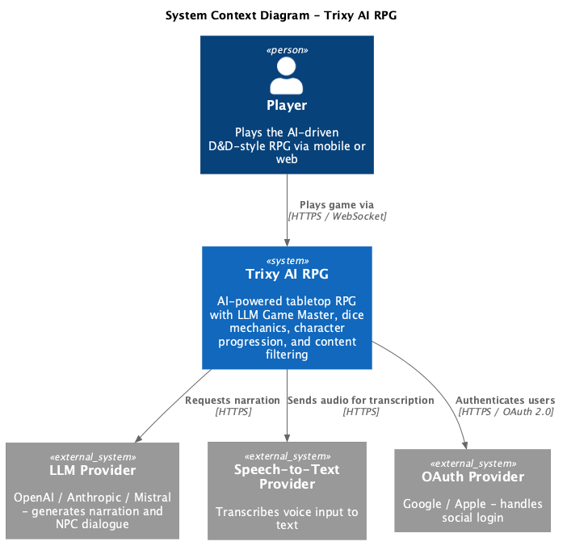
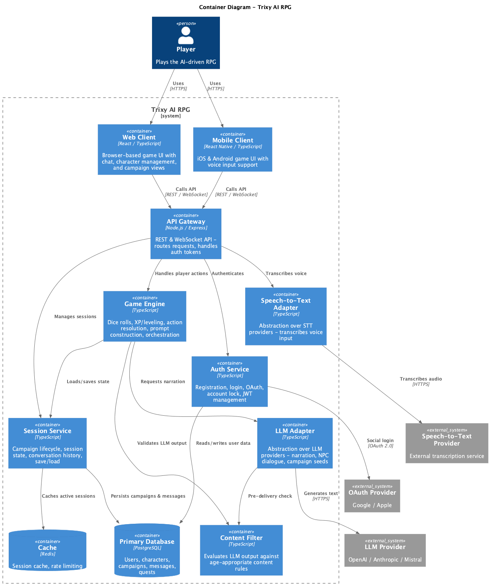

# Trixy AI RPG – System Design

This document describes the high-level architecture of the Trixy AI RPG system using C4 model diagrams.

## C1 – System Context

The System Context diagram shows Trixy as a whole and its relationships with external actors and systems.



**Key elements:**

- **Player** – End user who interacts with the game via mobile (iOS/Android) or web browser.
- **Trixy AI RPG** – The core system providing an AI-powered tabletop RPG experience with an LLM-based Game Master, dice mechanics, character progression, and content filtering.
- **LLM Provider** – External AI service (OpenAI, Anthropic, or Mistral) that generates narration and NPC dialogue.
- **Speech-to-Text Provider** – External service that transcribes voice input into text.
- **OAuth Provider** – Google/Apple identity providers for social login.

---

## C2 – Container

The Container diagram zooms into the Trixy system boundary, showing the major deployable units and their interactions.



**Containers:**

| Container | Technology | Responsibility |
|-----------|-----------|----------------|
| Web Client | React / TypeScript | Browser-based game UI |
| Mobile Client | React Native / TypeScript | iOS & Android game UI with voice input |
| API Gateway | Node.js / Express | REST & WebSocket API, request routing, auth token handling |
| Auth Service | TypeScript | Registration, login, OAuth, account lock, JWT |
| Session Service | TypeScript | Campaign lifecycle, session state, save/load |
| Game Engine | TypeScript | Dice rolls, XP/leveling, action resolution, prompt construction |
| Content Filter | TypeScript | Validates LLM output against age-appropriate rules |
| LLM Adapter | TypeScript | Abstraction over LLM providers |
| Speech-to-Text Adapter | TypeScript | Abstraction over STT providers |
| PostgreSQL | Database | Users, characters, campaigns, messages, quests |
| Redis | Cache | Session cache, rate limiting |

**Key design decisions:**

1. **Single backend, multiple clients** – Both web and mobile clients consume the same REST/WebSocket API, ensuring consistent game state and cross-platform sync.
2. **LLM behind adapter** – Swappable provider (no vendor lock-in), API keys stay server-side.
3. **Separation of mechanics and narration** – Dice, XP, and leveling are deterministic in the Game Engine; the LLM only handles storytelling.
4. **Content filter as pipeline stage** – Every LLM response passes through the filter before reaching the player.

---

## Rendering the diagrams

The `.puml` source files are in `diagrams/` and use the [C4-PlantUML](https://github.com/plantuml-stdlib/C4-PlantUML) library. To re-render:

```bash
# Requires plantuml CLI (brew install plantuml)
plantuml -tpng docs/design/diagrams/c1-system-context.puml -o docs/design/diagrams/
plantuml -tpng docs/design/diagrams/c2-container.puml -o docs/design/diagrams/
```

> **Note:** The VS Code PlantUML plugin may fail if its bundled PlantUML JAR is outdated. Use the CLI (`plantuml` via Homebrew, v1.2026.3+) which renders correctly.
